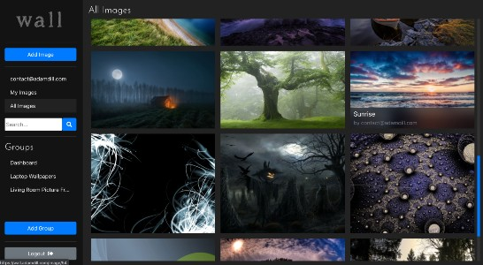

# wall
[wall.adamdill.com](https://wall.adamdill.com)

This is a wallpaper site with the primary goal of allowing the grouping of images which can then be accessed through an webservice. The original use-case was to provide a way to easily change out the background of a dashboard app, but it could be applied to any application that would need to access images from a service rather than include the images in the application.

To setup:
1. Load the db_schema.sql file into your MySQL database.
2. Create an .env file with the following variables:
    - NODE_ENV - set to develop or production
    - MYSQL_HOST - MySQL host url
    - MYSQL_PORT - the port the database is on
    - MYSQL_USER - MySQL user name
    - MYSQL_PASSWORD - MySQL password
    - JWT_SECRET - a string to be used to salt the token
    - MAIL_HOST - mail host to be used for password recovery
    - MAIL_PORT
    - MAIL_USER
    - MAIL_PASS

To test:
1. Start MySql server with <code>mamp start</code>.
2. Start the Apollo/Express server by running <code>npm run start</code> in the root directory.
3. Start the React client app by <code>cd client</code> and then running <code>npm run start</code>.
